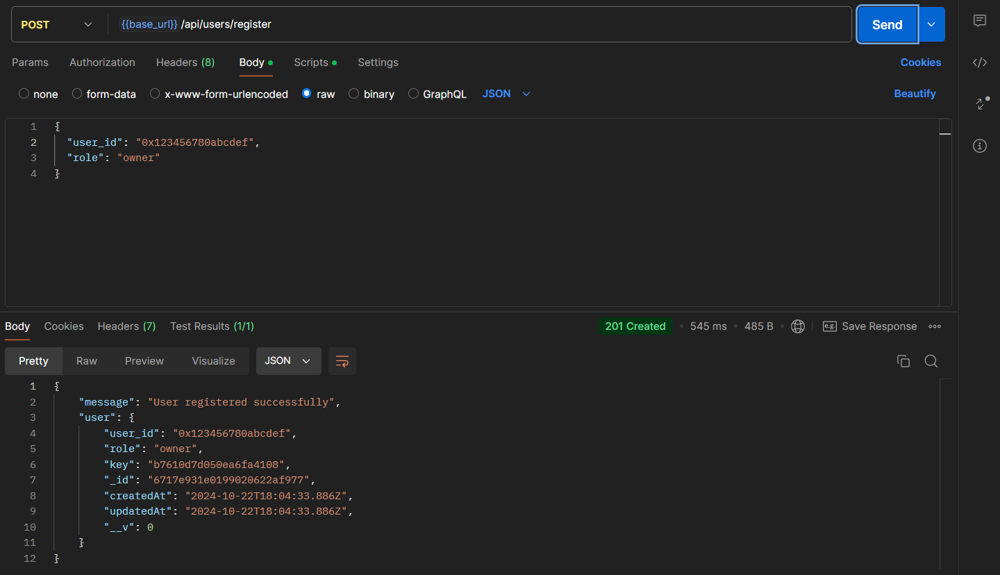
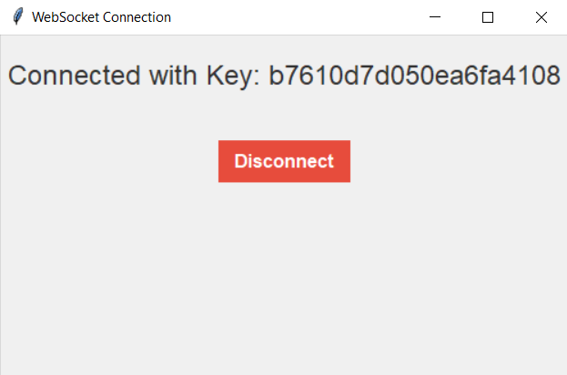
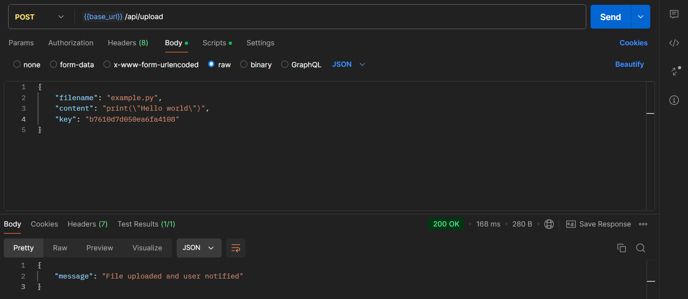
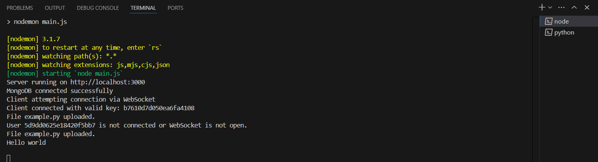

## Blockchain Technologies. Assignment 3: Decentralized Computational Resource Sharing Platform
### Nurlybay Bexultan and Sherkhan Kashshafidin from group IT-2205

### Description
This is the first part of the project. We realized 2 core feature which was "Resource Monitoring & Real-Time Data". So we created small app that connects to server and do tasks such as fetching uploaded python files, execute python files, transfer output results back to server and transfer pc resource stats to server. Also we created small part of server to demonstract core feature.

### Connection Setup
1) Go to server directory, install all dependencies and run server:
```
$ cd server
$ npm install
$ npm run start
```
2) Go to app directory, install all packages and run application:
```
$ cd ../app
$ pip install -r requirements.txt
$ python app.py
```
3) Open postman in order to simulate user who wants to upload python files to get output results.

### Working process

1) In order to share resouce you have to register to website. In postman create post request and send it like shown below:
> [!NOTE]
> user_id has to be different.
```
http://localhost:3000/api/register
```


2) Copy the key from response and paste it into application textbox and submit it. You can see similar result:


3) In order to send file to resource you have to write propers request:
```
http://localhost:3000/api/upload
```


3) Results can be seen in console:

